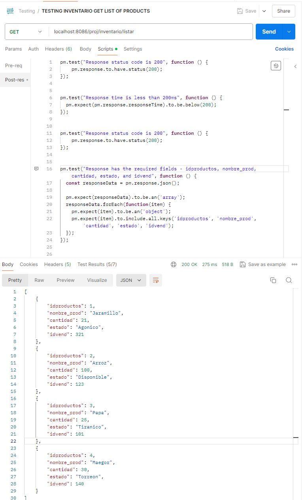
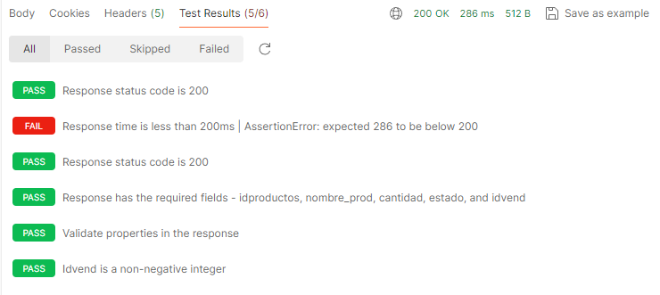
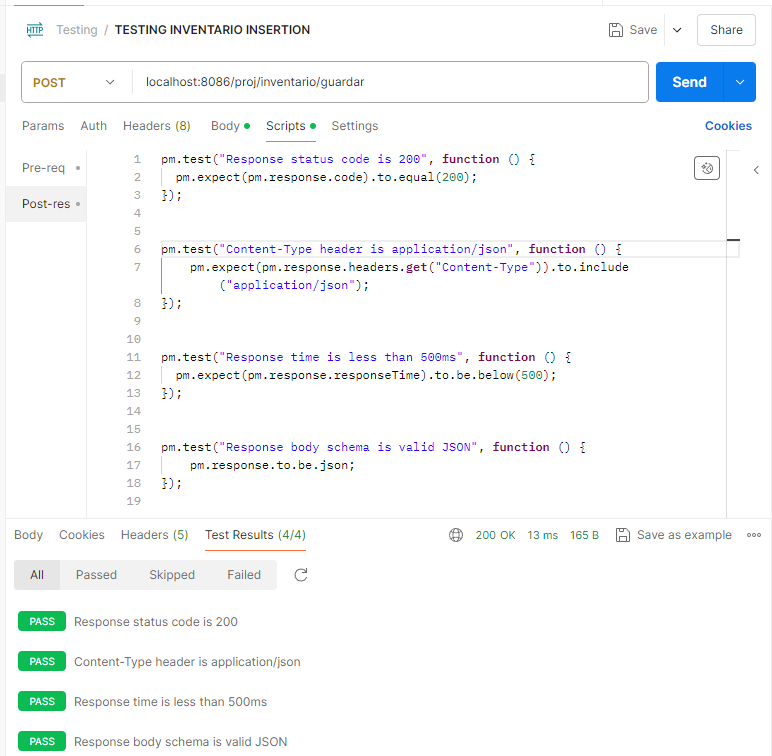
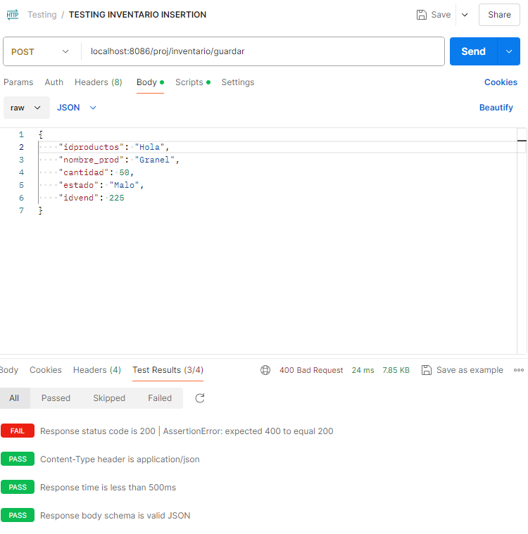
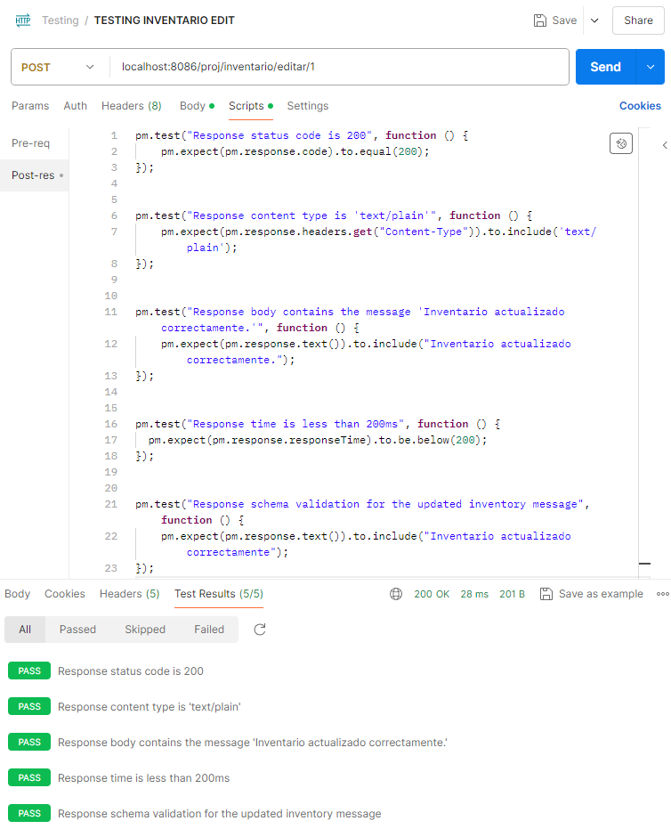
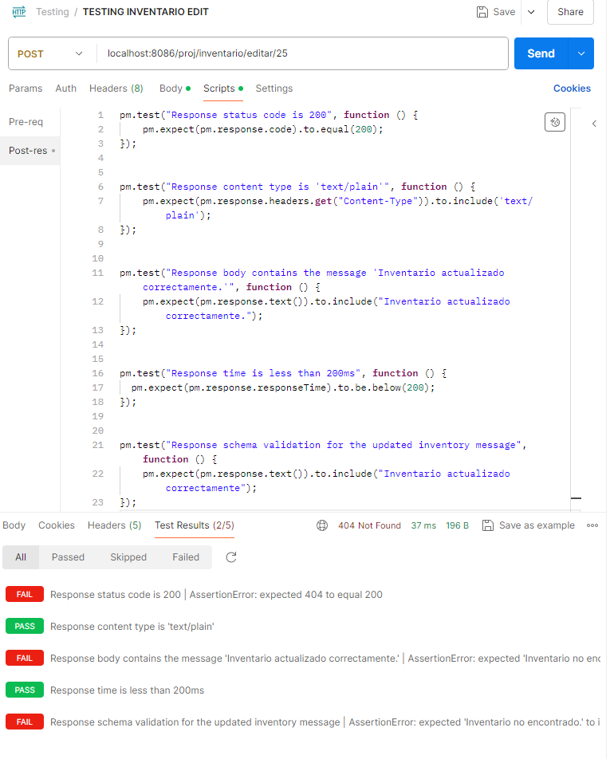
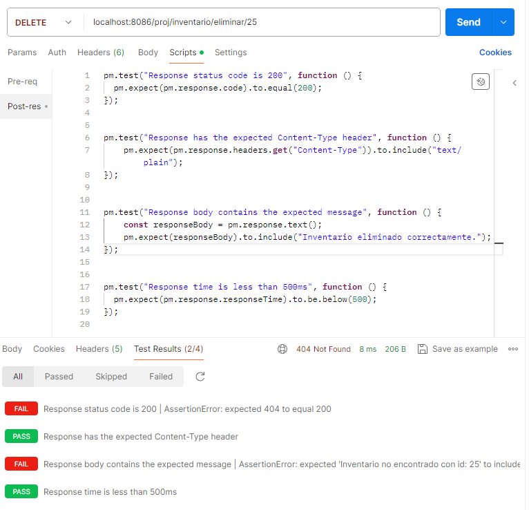
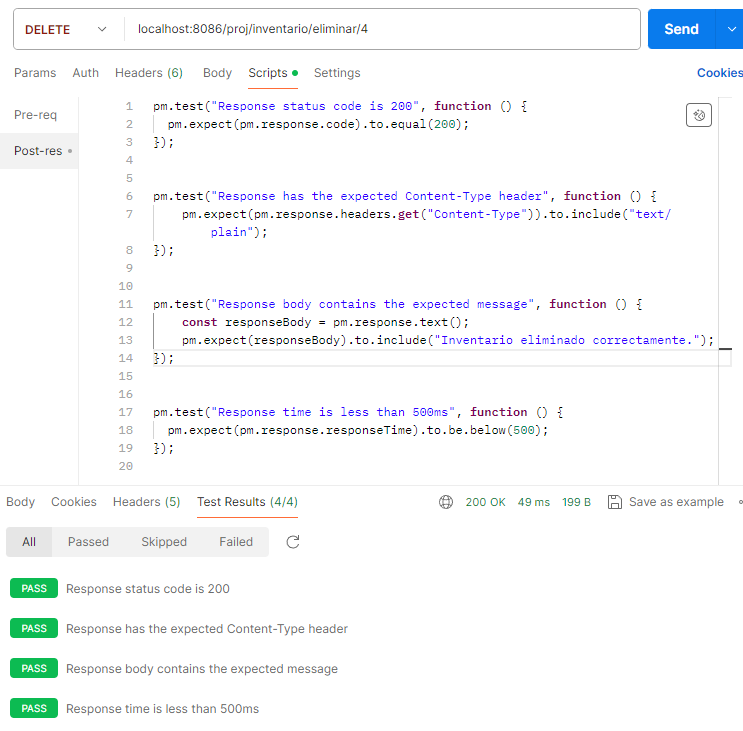

# Qaliwarma Services

## 📜 Vista General de Arquitectura

El patrón **MVC (Modelo-Vista-Controlador)** es una arquitectura que separa una aplicación en tres componentes interconectados. Esta separación permite gestionar la complejidad y facilita la escalabilidad y el mantenimiento del código.

- **Modelo**: Representa los datos y la lógica de negocio. En nuestro proyecto, las clases de entidades se encuentran en el paquete `dominio`.
- **Vista**: Presenta la interfaz de usuario y los datos al usuario final. En nuestro proyecto, se encuentra en la capa `presentación`.
- **Controlador**: Maneja la entrada del usuario, actualiza el modelo y selecciona la vista adecuada para responder. En nuestro proyecto, se encuentra en la capa `presentación` junto con las vistas.

### 📁 Nombre de Paquetes, Módulos, Clases, Interfaces, Atributos/Argumentos y Operaciones

- **Paquetes**:
  - `com.dseproj.qaliservices.controller` - Contiene los controladores que manejan las solicitudes HTTP.
  - `com.dseproj.qaliservices.entity` - Contiene las entidades que representan los datos.
  - `com.dseproj.qaliservices.impl` - Contiene las implementaciones de los servicios.
  - `com.dseproj.qaliservices.repository` - Contiene los repositorios para el acceso a datos.
  - `com.dseproj.qaliservices.services` - Contiene las interfaces de los servicios.

- **Módulos y Clases**:
  - **Modelo**:
    - `InventarioEntity` - Representa un producto en inventario.
  - **Controlador**:
    - `InventarioController` - Maneja las solicitudes relacionadas con inventario.
    - `DocumentManagementController` - Maneja las solicitudes relacionadas con la gestión de documentos.
  - **Servicio**:
    - `InventarioImpl` - Implementa la lógica de negocio para inventarios.
    - `DocumentManagementServiceImpl` - Implementa la lógica de negocio para la gestión de documentos.
  - **Repositorio**:
    - `InventarioRepository` - Maneja la persistencia de datos de inventario.
  - **Interfaces**:
    - `IInventario` - Define las operaciones de CRUD para `InventarioEntity`.
    - `DocumentManagementService` - Define las operaciones para la gestión de documentos.

- **Atributos/Argumentos**:
  - `idproductos`, `nombre_prod`, `cantidad`, `estado`, `idvend` en `InventarioEntity`.

- **Operaciones**:
  - **CRUD**: `save()`, `delete()`, `listar()`, `listarid()`, `actualizar()`.

## 📁 Estructura de Paquetes

La estructura de paquetes sigue las directrices de Spring (MVC) y JPA (ORM), y está organizada para separar claramente las responsabilidades en el proyecto. A continuación se detalla la estructura de paquetes y su propósito:

### 📂 `com.dseproj.qaliservices`

- **`controller`**: Contiene los controladores que manejan las solicitudes HTTP y gestionan la interacción entre la vista y el modelo.
  - `InventarioController.java`: Controlador para manejar las operaciones relacionadas con el inventario, como la creación, lectura, actualización y eliminación de productos.
  - `DocumentManagementController.java`: Controlador para gestionar las operaciones relacionadas con la gestión de documentos.

- **`entity`**: Contiene las clases de entidad que representan los modelos de datos utilizados en la aplicación.
  - `InventarioEntity.java`: Entidad que representa un producto en el inventario, con atributos como `idproductos`, `nombre_prod`, `cantidad`, `estado` y `idvend`.

- **`impl`**: Contiene las implementaciones de los servicios definidos en la capa de servicios.
  - `DocumentManagementServiceImpl.java`: Implementación del servicio para la gestión de documentos.
  - `InventarioImpl.java`: Implementación del servicio para el manejo de operaciones relacionadas con el inventario.

- **`repository`**: Contiene las interfaces de repositorio que proporcionan métodos para acceder y manipular los datos en la base de datos.
  - `InventarioRepository.java`: Repositorio para manejar la persistencia de datos de `InventarioEntity` utilizando Spring Data JPA.

- **`services`**: Contiene las interfaces que definen los contratos para los servicios de la aplicación.
  - `DocumentManagementService.java`: Interfaz que define las operaciones para la gestión de documentos.
  - `IInventario.java`: Interfaz que define las operaciones de CRUD para `InventarioEntity`.

- **`QaliservicesApplication.java`**: Clase principal que arranca la aplicación Spring Boot.
- **`ServletInitializer.java`**: Configuración para inicializar el servlet en entornos no estándar.

com.dseproj.qaliservices
|----controller
|--------InventarioController.java
|--------DocumentManagementController.java
|----entity
|--------InventarioEntity.java
|----impl
|--------DocumentManagementServiceImpl.java
|--------InventarioImpl.java
|----repository
|--------InventarioRepository.java
|----services
|--------DocumentManagementService.java
|--------IInventario.java
|----QaliservicesApplication.java
|----ServletInitializer.java

### 🗂 Nombres de Directorios/Archivos

- **Directorios**:
  - `controller` - Controladores.
  - `service` - Servicios.
  - `repository` - Repositorios.
  - `model` - Entidades.

## 🛠 Dependencias para el MVC, CRUD, y Buenas Prácticas

### 📝 CRUD

- Implementa operaciones de **Create**, **Read**, **Update**, y **Delete** utilizando Spring Data JPA.

### 📚 Principios SOLID

- **S**: Single Responsibility Principle
- **O**: Open/Closed Principle
- **L**: Liskov Substitution Principle
- **I**: Interface Segregation Principle
- **D**: Dependency Inversion Principle

### 📦 DDD (Domain-Driven Design)

- **Entidades**: Definidas en el dominio.
- **Repositorios**: Implementados para manejar la persistencia.
- **Servicios**: Implementan la lógica de negocio.

## 🧪 Casos de Prueba por Medio de Postman

### 1. 📋 Implementar los Casos de Prueba como Scripts Postman

- **CRUD**: Prueba cada operación del CRUD.

- Se realizan los testing de las funciones **Create**, **Read**, **Update**, y **Delete** utilizando Postman.

- Para ello se crea un Workspace con las colecciones correspondientes

### 2. ▶️ Ejecutar los Casos de Prueba ✅ Y Verificar Resultados

- Posteriormente mandamos los test correspondientes por cada uno de los servicios implementados

### Listar Inventario

- En este caso al ser un get el unico caso es llamar al servicio correspondiente, que no realiza modificaciones

- **Tests Pasados y Declinados en Listar 4/5 Test Pasados**

### Insercion de Elementos en el Inventario

- **Tests Pasados y Declinados en Insert 4/4 Test Pasados** Caso 1: El archivo .json es mandado de forma correcta respetando los tipos de datos

- Caso 2: El archivo .json es mandado de forma incorrecta sin respetar los tipos de datos **Cuando?** El envio de datos es incorrecto, **3/4 Test Pasados**

### Actualizacion de Elementos en el Inventario

- **Tests Pasados y Declinados en Actualizacion 5/5 Test Pasados** Caso 1: El ID si se encuentra en la BD

- Caso 2: El ID no se encuentra en la BD

### Eliminacion de Elementos en el Inventario

- **Tests Pasados y Declinados en la Eliminacion 2/4 Test Pasados** Caso 1: Mandamos una cadena cuyo ID no se encuentre en la BD

- Caso 2: Mandamos una cadena cuyo ID si se encuentre en la BD

- **Todos los Test y Collections se encuentran en el WORKSPACE y han sido exportados a un archivo .JSON para su importacion usando POSTMAN**

- **Casos de Prueba**: Revisa los resultados para verificar qué casos pasaron o fallaron.

## 📝 Trello

